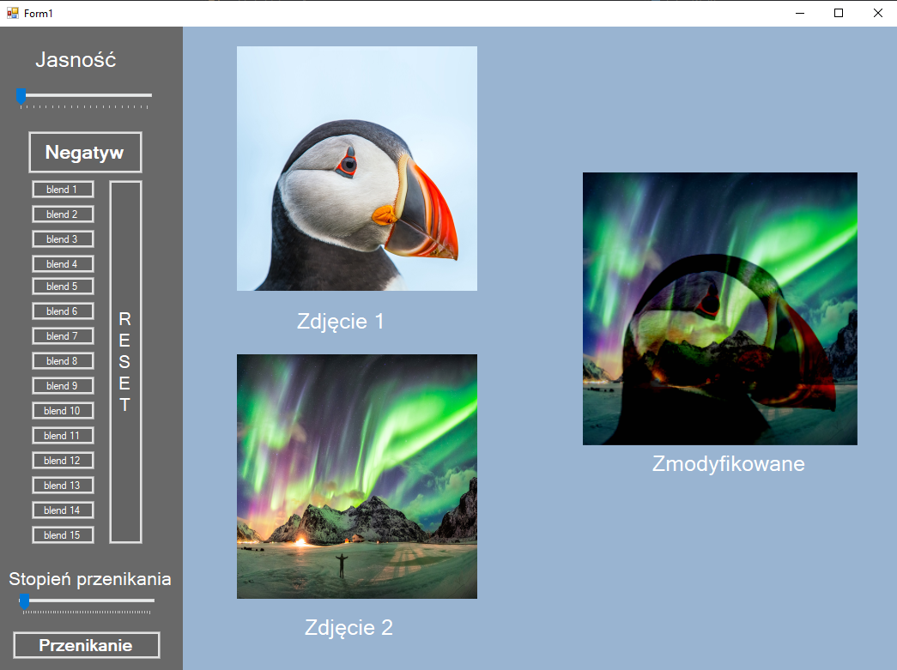

# grafikaLab5
Program napisany w języku C# przy wykorzystaniu windows forms do GUI.  
Program zawiera w sobie obydwa zadania z laboratorium 5, czyli umożlwia manipulacje jasnością i tworzenie negatywu oraz używanie wszystkich 16 trybów mieszania zdjęć.

# Opis kontrolek
## Zadanie 1
* Jasność - umożliwia sterowanie jasnością obrazu w polu zmodyfikowane
* Negatyw - odwraca kolory zdjęcia tworząc negatyw
## Zadanie 2
* blend 1 - blend 15 - po kliknięciu miesza obydwa zdjęcia według jednego z 15 odmian blendowania
* Reset - przywraca domysly wygląd zdjecia w polu zmodyfikowane
* Stopien przenikania - tutaj ustawiamy wartosc (1-255) przenikana która jest następnie przekazywana do fukncji guzika "Przenikanie"
* Przenikanie - pobiera wartosc z suwaka i według niej miesza ze sobą 2 zdjęcia
# Działanie programu, funkcje, algorytmy
Działanie programu opiera się na klasie BitMap. Pobieram bitmapy z obydwu zdjęć, by następnie je modyfikować zależnie od rodzaju wybranego mieszania.  
Każdy guzik zawiera w sobie funkcję odpowiednio mieszającą konkretne kolory pixeli z obydwu zjdęć. W pętli iteruje po kolejnych pixelach bitmapy i według wzoru nadpisuję pixele w 
bitmapie zdjęcia wyjściowego. Po wykonaniu algorytmu do pola wynikowego zjdęć wrzucam bitmapę powstałą w wyniku danego algorytmu mieszania.  
Oprócz tego trzymam w ryzach zakres 0-255 za pomocą funkcji checkIfInRGB która w przypadku przekroczenia zakresu zwraca jedną z dwóch skrajnych wartości 0 lub 255, a dokładniej
1 lub 254 żeby uniknąć dzielenia przez 0 w niektórych algorytmach. W wyniku tej funkcji niektóre wyniki mieszania są przejaskrawione lub bardzo ciemne.  
Do sterowania jasnością używam macierzy kolorów, wykorzystuję klasę ColorMatrix i nadpisuję ją pobierając wartości z suwaka "Jasnośc"
